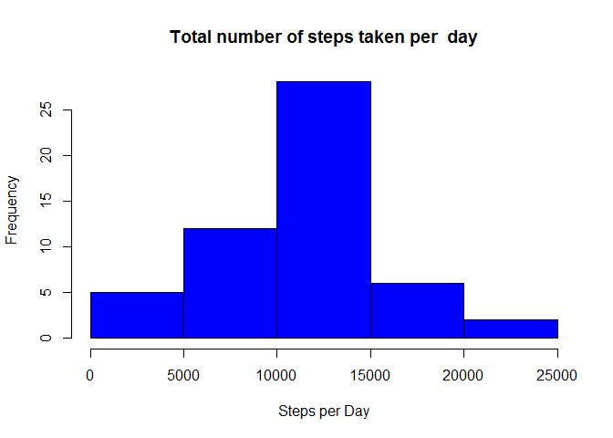
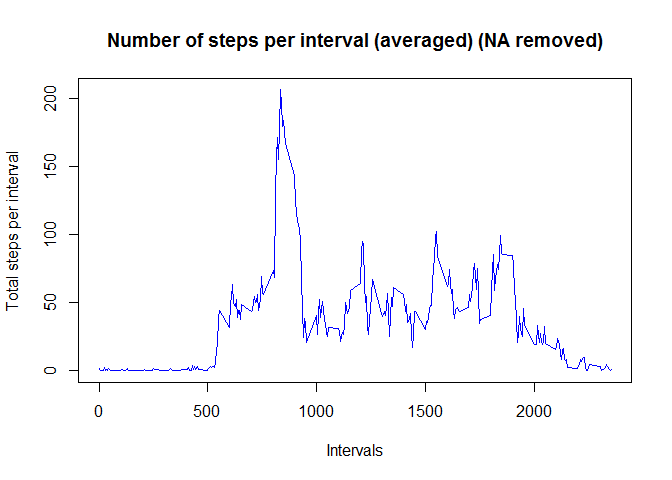
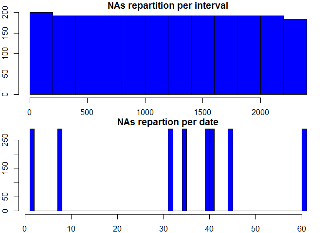
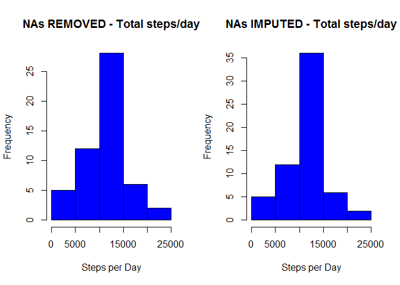
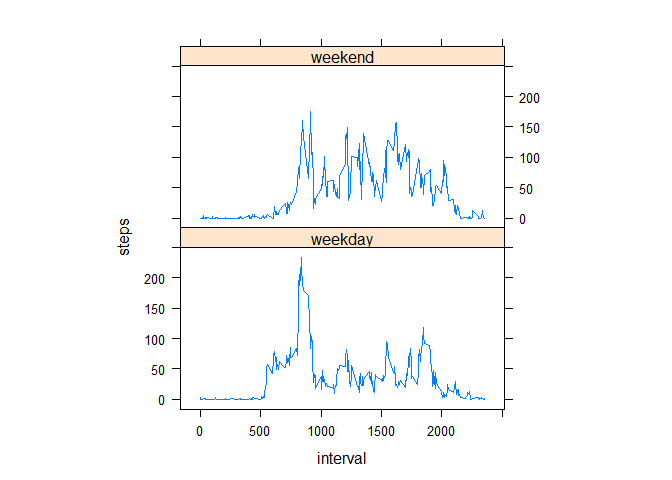

```r
my_render <- function(PA1_template.Rmd, encoding) {
    rmarkdown::render(PA1_template.Rmd, clean = FALSE, encoding = encoding)
}
```
---
title: "PA1_template.Rmd"
author: "Girish Desai"
date: "April 22, 2018"
output: html_fragment
---
#Loading and preprocessing the data


```r
setwd("C:/Users/t15cgvz/Desktop/R/ReproducibleResearch")
path <- getwd()
rm(list=ls())
activity <- read.csv("activity.csv")
###Processing the Data
activity$day <- weekdays(as.Date(activity$date))
activity$DateTime<- as.POSIXct(activity$date, format="%Y-%m-%d")
#clean <- activity[!is.na(activity$steps),]
summary(activity)
```

```
##      steps                date          interval          day           
##  Min.   :  0.00   2012-10-01:  288   Min.   :   0.0   Length:17568      
##  1st Qu.:  0.00   2012-10-02:  288   1st Qu.: 588.8   Class :character  
##  Median :  0.00   2012-10-03:  288   Median :1177.5   Mode  :character  
##  Mean   : 37.38   2012-10-04:  288   Mean   :1177.5                     
##  3rd Qu.: 12.00   2012-10-05:  288   3rd Qu.:1766.2                     
##  Max.   :806.00   2012-10-06:  288   Max.   :2355.0                     
##  NA's   :2304     (Other)   :15840                                      
##     DateTime                  
##  Min.   :2012-10-01 00:00:00  
##  1st Qu.:2012-10-16 00:00:00  
##  Median :2012-10-31 00:00:00  
##  Mean   :2012-10-31 00:25:34  
##  3rd Qu.:2012-11-15 00:00:00  
##  Max.   :2012-11-30 00:00:00  
## 
```

```r
str(activity)
```

```
## 'data.frame':	17568 obs. of  5 variables:
##  $ steps   : int  NA NA NA NA NA NA NA NA NA NA ...
##  $ date    : Factor w/ 61 levels "2012-10-01","2012-10-02",..: 1 1 1 1 1 1 1 1 1 1 ...
##  $ interval: int  0 5 10 15 20 25 30 35 40 45 ...
##  $ day     : chr  "Monday" "Monday" "Monday" "Monday" ...
##  $ DateTime: POSIXct, format: "2012-10-01" "2012-10-01" ...
```
Inspect the dataset

```
##      steps                date          interval          day           
##  Min.   :  0.00   2012-10-01:  288   Min.   :   0.0   Length:17568      
##  1st Qu.:  0.00   2012-10-02:  288   1st Qu.: 588.8   Class :character  
##  Median :  0.00   2012-10-03:  288   Median :1177.5   Mode  :character  
##  Mean   : 37.38   2012-10-04:  288   Mean   :1177.5                     
##  3rd Qu.: 12.00   2012-10-05:  288   3rd Qu.:1766.2                     
##  Max.   :806.00   2012-10-06:  288   Max.   :2355.0                     
##  NA's   :2304     (Other)   :15840                                      
##     DateTime                  
##  Min.   :2012-10-01 00:00:00  
##  1st Qu.:2012-10-16 00:00:00  
##  Median :2012-10-31 00:00:00  
##  Mean   :2012-10-31 00:25:34  
##  3rd Qu.:2012-11-15 00:00:00  
##  Max.   :2012-11-30 00:00:00  
## 
```

```r
str(activity)
```

```
## 'data.frame':	17568 obs. of  5 variables:
##  $ steps   : int  NA NA NA NA NA NA NA NA NA NA ...
##  $ date    : Factor w/ 61 levels "2012-10-01","2012-10-02",..: 1 1 1 1 1 1 1 1 1 1 ...
##  $ interval: int  0 5 10 15 20 25 30 35 40 45 ...
##  $ day     : chr  "Monday" "Monday" "Monday" "Monday" ...
##  $ DateTime: POSIXct, format: "2012-10-01" "2012-10-01" ...
```
knit("PA1_template.Rmd")
markdownToHTML('PA1_template.md', 'PA1_template.html', options=c("use_xhml"))

#What is mean total number of steps taken per day?

###1. Total number of steps taken per day


```r
activity_steps_day <- aggregate(steps ~ date, data = activity, FUN = sum, na.rm = TRUE)
head(activity_steps_day)
```

```
##         date steps
## 1 2012-10-02   126
## 2 2012-10-03 11352
## 3 2012-10-04 12116
## 4 2012-10-05 13294
## 5 2012-10-06 15420
## 6 2012-10-07 11015
```

###2. Histogram of the total number of steps taken each day.


```r
hist(activity_steps_day$steps, xlab = "Steps per Day", main = "Total number of steps taken per  day", col = "blue")
```

<!-- -->

###3. Mean and median of the total number of steps taken per day

```r
mean_steps <- mean(activity_steps_day$steps)
median_steps <- median(activity_steps_day$steps)
mean_steps <- format(mean_steps,digits=1)
median_steps <- format(median_steps,digits=1)
#abline(v=mean_steps, lwd = 3, col = 'blue')
#abline(v=median_steps, lwd = 3, col = 'red')
```

    Mean steps per day: 10766

    Median steps per day: 10765

#What is the average daily activity pattern? 

###1. Make a time series plot (i.e. type = "l") of the 5-minute interval (x-axis) and the average number of steps taken, averaged across all days (y-axis)


```r
activity_steps_mean <- aggregate(steps ~ interval, data = activity, FUN = mean, na.rm = TRUE)
#Plot
plot(activity_steps_mean$interval, activity_steps_mean$steps, type = "l", col = "blue", xlab = "Intervals", ylab = "Total steps per interval", main = "Number of steps per interval (averaged) (NA removed)")
```

<!-- -->

###2. Which 5-minute interval, on average across all the days in the dataset, contains the maximum number of steps?


```r
#Max stepsin given interval
max_steps <-max(activity_steps_mean$steps)

# Which interval are the numbers of steps are highest per interval? 
max_interval <- activity_steps_mean$interval[which(activity_steps_mean$steps == max_steps)]
max_steps <- round(max_steps, digits = 2)
```

The highest number of steps for a 5 minutes interval is 206.17,

which corresponds to interval 835

#Imputing missing values

###1. Calculate and report the total number of missing values in the dataset (i.e. the total number of rows with NAs)

    sum(is.na(activity))

    Missing Values : 2304

###2. Devise a strategy for filling in all of the missing values in the dataset. The strategy does not need to be sophisticated. For example, you could use the mean/median for that day, or the mean for that 5-minute interval, etc.

  We run a couple of unsophisticated charts to decide which unsophisticated strategy we'll adopt
    

```r
#subset general dataset with missing values only
missing_values <- subset(activity, is.na(steps))
#plot repartition, by date or by intervals
par(mfrow = c(2,1), mar = c(2, 2, 1, 1))
hist(missing_values$interval, main="NAs repartition per interval", col = "blue")
hist(as.numeric(missing_values$date), main = "NAs repartion per date", breaks = 61, col = "blue")
```

<!-- -->

  We see that NAs run equally over all intervals. On the other hand, checking with dates, we see all NA's are spread between 8 specific days only. To reduce that effect, best will be to take the mean for missing interval across all the days in the dataset.

###3. Create a new dataset that is equal to the original dataset but with the missing data filled in.


```r
# calculate mean of steps per interval, we end up with a mean for all 288 intervals
MeanStepsPerInterval <- tapply(activity$steps, activity$interval, mean, na.rm = TRUE)
# cut the 'activity' dataset in 2 parts (with and without NAs)
activity_NAs <- activity[is.na(activity$steps),]
activity_non_NAs <- activity[!is.na(activity$steps),]
#replace missing values in activity_NAs
activity_NAs$steps <- as.factor(activity_NAs$interval)
levels(activity_NAs$steps) <- MeanStepsPerInterval
#change the vector back as integer 
levels(activity_NAs$steps) <- round(as.numeric(levels(activity_NAs$steps)))
activity_NAs$steps <- as.integer(as.vector(activity_NAs$steps))
#merge/rbind the two datasets together
imputed_activity <- rbind(activity_NAs, activity_non_NAs)
```

###4. Make a histogram of the total number of steps taken each day and Calculate and report the mean and median total number of steps taken per day. Do these values differ from the estimates from the first part of the assignment? What is the impact of imputing missing data on the estimates of the total daily number of steps?


```r
#Plotting parameters to place previous histogram and new one next to each other
par(mfrow = c(1,2))
#Plot again the histogram from the first part of the assignment
activity_steps_day <- aggregate(steps ~ date, data = activity, FUN = sum, na.rm = TRUE)
hist(activity_steps_day$steps, xlab = "Steps per Day", main = "NAs REMOVED - Total steps/day", col = "blue")
#Plot new histogram, with imputed missing values
imp_activity_steps_day <- aggregate(steps ~ date, data = imputed_activity, FUN = sum, na.rm = TRUE)
hist(imp_activity_steps_day$steps, xlab = "Steps per Day", main = "NAs IMPUTED - Total steps/day", col = "blue")
```

<!-- -->

```r
imp_mean_steps <- mean(imp_activity_steps_day$steps)
imp_median_steps <- median(imp_activity_steps_day$steps)
#we set a normal number format to display the results
imp_mean_steps <- format(imp_mean_steps,digits=1)
imp_median_steps <- format(imp_median_steps,digits=1)
#store the results in a dataframe
results_mean_median <- data.frame(c(mean_steps, median_steps), c(imp_mean_steps, imp_median_steps))
colnames(results_mean_median) <- c("NA removed", "Imputed NA values")
rownames(results_mean_median) <- c("mean", "median")

head(results_mean_median)
```

```
##        NA removed Imputed NA values
## mean        10766             10766
## median      10765             10762
```

    CONCLUSIONS:The mean value is the same as the value before imputing missing data because we put the mean value for that particular 5-min interval. The median value shows a little difference : but it depends on where the missing values are.

#Are there differences in activity patterns between weekdays and weekends?


###1. Create a new factor variable in the dataset with two levels - "weekday" and "weekend" indicating whether a given date is a weekday or weekend day.


```r
activity$day=ifelse(as.POSIXlt(as.Date(activity$date))$wday%%6==0,
                          "weekend","weekday")
# For Sunday and Saturday : weekend, Other days : weekday 
activity$day=factor(activity$day,levels=c("weekday","weekend"))
```

###2. Make a panel plot containing a time series plot (i.e. type = "l") of the 5-minute interval (x-axis) and the average number of steps taken, averaged across all weekday days or weekend days (y-axis). See the README file in the GitHub repository to see an example of what this plot should look like using simulated data.


```r
stepsInterval2=aggregate(steps~interval+day,activity,mean)
library(lattice)
```

```
## Warning: package 'lattice' was built under R version 3.4.4
```

```r
xyplot(steps~interval|factor(day),data=stepsInterval2,aspect=1/2,type="l")
```

<!-- -->
